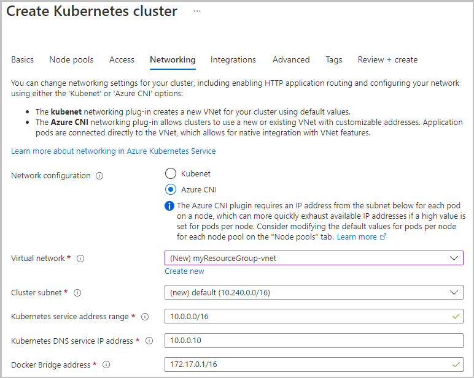

# Deploy with Azure CNI

By default, AKS clusters use kubenet and create a virtual network and subnet. With kubenet, nodes get an IP address from a virtual network subnet. Network address translation (NAT) is then configured on the nodes, and pods receive an IP address "hidden" behind the node IP. This approach reduces the number of IP addresses that you need to reserve in your network space for pods to use.

With Azure Container Networking Interface (CNI), every pod gets an IP address from the subnet and can be accessed directly. Systems in the same virtual network as the AKS cluster see the pod IP as the source address for any traffic from the pod. Systems outside the AKS cluster virtual network see the node IP as the source address for any traffic from the pod. These IP addresses must be unique across your network space and must be planned in advance. Each node has a configuration parameter for the maximum number of pods that it supports. The equivalent number of IP addresses per node are then reserved up front for that node.

## 1. Configure networking - CLI

When you create an AKS cluster with the Azure CLI, you can also configure Azure CNI networking. Use the following commands to create a new AKS cluster with Azure CNI networking enabled.

First, get the subnet resource ID for the existing subnet into which the AKS cluster will be joined:


```bash
yumemaru@Azure:~/LabAKS$ az network vnet subnet list \
    --resource-group myVnet \
    --vnet-name myVnet \
    --query "[0].id" --output tsv

/subscriptions/<guid>/resourceGroups/myVnet/providers/Microsoft.Network/virtualNetworks/myVnet/subnets/default
```

Use the az aks create command with the --network-plugin azure argument to create a cluster with advanced networking. Update the --vnet-subnet-id value with the subnet ID collected in the previous step:

```bash
yumemaru@Azure:~/LabAKS$ az aks create \
    --resource-group myResourceGroup \
    --name myAKSCluster \
    --network-plugin azure \
    --vnet-subnet-id <subnet-id> \
    --docker-bridge-address 172.17.0.1/16 \
    --dns-service-ip 10.2.0.10 \
    --service-cidr 10.2.0.0/24 \
    --generate-ssh-keys
```
## 2. Configure networking - portal
The following screenshot from the Azure portal shows an example of configuring these settings during AKS cluster creation:

